<div align="center">


</div>

<table>
<tr>
<td width="34%" align="center">

</td>
<td width="66%" align="center">


<br>


</td>
</tr>
</table>

---

```
pranav@github ~ % brew --info me

  ═══════════════════════════════════════════════════════
    name        : Pranav Mundhra
    location    : India
    roast       : dark — same as my editor theme
    languages   : [ Python, C++, JavaScript ]
    building    : small tools that fix real annoyances
    grinding    : DSA on LeetCode + CodeChef
    fuel level  : ████████░░  80%
    uptime      : ~5 cups/day, results may vary
    motto       : "compile, sip, repeat"
  ═══════════════════════════════════════════════════════

[ brewed successfully in 0.42s ]
```

<!--
  WANT THE DESK PHOTO BACK?
  Commit a photo as desk.jpg, then wrap the code block above in this:

  <table><tr>
  <td width="62%" valign="top">
  ...the code block goes here...
  </td>
  <td width="38%" valign="top" align="center">
  
  </td>
  </tr></table>
-->

<br>

## ☕ Currently Brewing

<table>
<tr>
<td width="50%" valign="top">

### [OTtools](https://github.com/PranavMundhra/OTtools)
`Python`
A toolkit built to make the tedious parts less tedious.

</td>
<td width="50%" valign="top">

### [BusNexus](https://github.com/PranavMundhra/BusNexus)
`Python`
Because figuring out bus routes shouldn't be harder than the commute.

</td>
</tr>
<tr>
<td width="50%" valign="top">

### [concept-linking-note-taking](https://github.com/PranavMundhra/concept-linking-note-taking)
`JavaScript`
Note-taking for students, where ideas link to each other instead of rotting in isolation.

</td>
<td width="50%" valign="top">

### [Tricoders.GDSC](https://github.com/PranavMundhra/Tricoders.GDSC)
`Python`
Helping students save money and spend responsibly.

</td>
</tr>
</table>

<br>

## 🫘 The Grinder

<div align="center">


</div>

<br>

## 📊 Brew Metrics

<div align="center">


</div>

<br>

## 🧩 The Daily Grind

<div align="center">

<a href="https://leetcode.com/u/pranavmundhra2005/">

</a>

</div>

<br>

## 🐍 Contribution Beans

<div align="center">

<picture>
  <source media="(prefers-color-scheme: dark)" srcset="https://raw.githubusercontent.com/PranavMundhra/PranavMundhra/output/snake-coffee-dark.svg" />
  
</picture>

</div>

<br>

## 🤝 Let's Grab a Coffee

<div align="center">

<a href="https://www.linkedin.com/in/pranavmundhra/"></a>
<a href="mailto:pranavmundhra2005@gmail.com"></a>
<a href="https://leetcode.com/u/pranavmundhra2005/"></a>
<a href="https://www.codechef.com/users/pranav124"></a>
<a href="https://instagram.com/pranavmundhra2005"></a>

</div>

<br>

<div align="center">

> *"A programmer is a machine that turns coffee into code.*
> *Mine runs on a slightly higher dosage."*


**thanks for stopping by — the pot's always on ☕**

</div>
